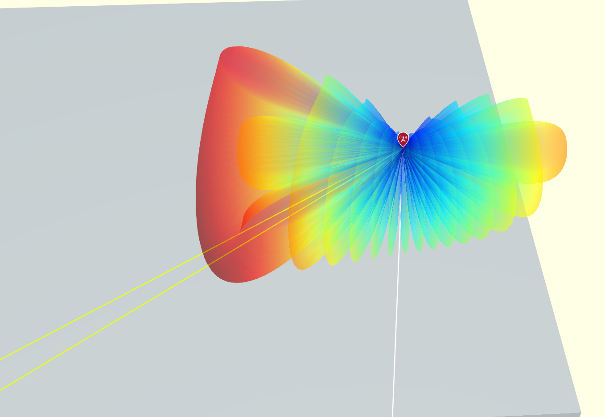

# Precoding and Beam Steering in a MIMO-OFDM System Using Ray Tracing in Sub-6GHz

This project explores beam steering techniques in a MIMO-OFDM system within the sub-6GHz frequency band using ray tracing simulations. The setup features a transmitter placed Electrical and Computer Engineering building and a receiver located several meters away. The simulation focuses on evaluating bit error rates (BER) and optimizing beam alignment for effective communication. 

## Features
- **MIMO-OFDM Precoding**: Models bit error rates for a multiple-input multiple-output orthogonal frequency division multiplexing system in the sub-6GHz spectrum employing channel sounding and precoding.
- **Ray Tracing Integration**: Implements ray tracing techniques to achieve precise beam steering and enhance signal alignment.
- **Realistic Setup**: Simulates practical deployment scenarios for wireless communication.
- **Customizable Parameters**: Easily adapt system configurations for different environments and use cases.

## Final Results
Site looks like this, 
<p align="center">
    
    <br>Beam steered site
</p>

<p align="center">
    
    <br>Transmitted Beam Alignmen
</p>

<p align="center">
    
    <br>Received Beam Alignment
</p>
<p align="center">
    
    <br>Received Constellation Diagram
</p>

And the simulation result is, 
```BER = 0.01464; No. of Bits Sent = 74874; No. of errors = 1096```


## Prerequisites
- MATLAB (R2020a or later is recommended)
- Communications Toolbox
- Phased Array System Toolbox
- Anternna toolbox

## Installation
1. Clone the repository:
   ```bash
   git clone https://github.com/saidur-rahman-shaown/beam_steering_and_precoding_mimo.git
   ```
2. Open MATLAB and navigate to the project folder.
3. Ensure the required toolboxes are installed.

## Usage
1. Configure array parameters in the `array_setup.m` file:
   - Transmitter and receiver positions

2. Configure system parameters in `MIMOOfdmBeamSteering.m` file:
   - Number of antennas and subcarriers
   - Frequency and bandwidth settings
2. Run the main simulation script:
   ```matlab
   run('MIMOOfdmBeamSteering.m')
   ```
3. Analyze the results:
   - BER for for channel characteristics
   - Propagating rays
   - Beamforming patterns
   - Log files detailing system performance

## Project Structure
- **MIMOOfdmBeamSteering.m**: Main script for running the simulation.
- **array_setup.m**: Contains configurable parameters for transmitter and receiver array.
- **applyChannel.m**: Apply Channel to the transmitted signal.
- **helperMIMOChannelEstimate.m**: It estimates the absolute channel and provided by matlab.
- **results/**: Stores simulation outputs.

## Project Workflow

### Sytem Parameters 
Define parameters for the system. These parameters can be modified to explore their impact on the system.

#### General System Parameters
- **Number of Users**: `1` (Single-user system)
- **Number of Independent Data Streams (numSTS)**: `16` (Options: 4, 8, 16, 32, 64)
- **Number of Transmit Antennas (numTx)**: `32`
- **Number of Receive Antennas (numRx)**: `16`
- **Bits per Subcarrier**: `6` (2: QPSK, 4: 16QAM, 6: 64QAM, 8: 256QAM)
- **Number of OFDM Data Symbols**: `10`

#### Frequency and Sampling Parameters
- **Carrier Frequency (fc)**: `4 GHz`
- **Channel Sampling Rate**: `100 Msps`
- **Noise Figure**: `5 dB`
- **Enable Steering**: `false`
- **Mobile Angle**: `[-90; 0]`

#### OFDM Modulation Parameters
- **FFT Length**: `256`
- **Cyclic Prefix Length**: `64`
- **Number of Carriers**: `234`
- **Guard Band Carriers**: `[7, 6]`
- **Pilot Carrier Indices**: `[26, 54, 90, 118, 140, 168, 204, 232]`
- **Non-Data Indices**: Calculated based on guard bands and pilot carrier indices.
- **Carrier Locations**: Calculated by excluding non-data indices from the FFT range.

#### Derived Parameters
- **Modulation Order**: `2^prm.bitsPerSubCarrier`
- **Number of Frame Bits**: `prm.numFrmBits = numSTS * numDataSymbols * numCarriers * bitsPerSubCarrier * 1/3 - 6`
- **Padding Zeros for Channel Filter Delay**: `3 * (FFTLength + CyclicPrefixLength)`

#### Array Information
- **Wavelength (lambda)**: `cLight / fc` (Calculated from the speed of light and carrier frequency)
- **Gain Factor**: `1`

### Transmitter and Reciever Placement 
For this purpose `array_setup.m` function is used which sets up transmitter (Tx) and receiver (Rx) arrays and their parameters, enabling Uniform Rectangular Array (URA) or Uniform Linear Array (ULA) configurations based on the input parameters. Also performs ray tracing analysis for the simulation.

#### Key Features
- Validates system parameters such as the number of antennas and data streams.
- Configures Tx and Rx arrays as URA or ULA based on system setup.
- Includes geographic positions and orientations for Tx and Rx.
- Supports ray tracing with a configurable number of reflections.
- Sets up phased array antennas for both Tx and Rx.

#### Parameters and Configurations
- **System Checks**:
  - Ensures `numSTS` is valid: `[1, 2, 4, 8, 16, 32, 64]`.
  - Validates `numTx` and `numRx` relative to `numSTS`.
  - Enforces that `numTx` is a multiple of `numSTS`.

- **Transmit (Tx) Setup**:
  - **Exp Factor Tx**: `prm.numTx / prm.numSTS`.
  - Determines whether the Tx uses URA or ULA based on the number of antennas and data streams.
  - Tx Position: `[23.726582, 90.389145, 23]` (latitude, longitude, height).
  - Tx Array Orientation: `[-90, 0]` (azimuth and elevation in degrees).

- **Receive (Rx) Setup**:
  - **Exp Factor Rx**: `prm.numRx / prm.numSTSVec`.
  - Determines whether each Rx uses URA or ULA.
  - Rx Position: `[23.725462, 90.387456, 15]` (latitude, longitude, height).
  - Rx Array Orientation: `[90, 0]` (azimuth and elevation in degrees).

 <p align="center">
    
    <br>Site after placing transmitter and receiver
</p>

- **Antenna Setup**:
  - Configures Tx and Rx arrays using `phased.URA` or `phased.ULA` with specified element spacing and properties.

#### Ray Tracing Analysis
- Utilizes the **ray tracing propagation model** with a specified number of reflections (`prm.reflectionsOrder`).
- Configures Tx and Rx sites using `txsite` and `rxsite` functions.
- Performs ray tracing.
<p align="center">
    
    <br>Rays from transmitter to receiver
</p>


### Channel Sounding
1. **Preamble Generation**:  
   - Generates and repeats preamble signals across transmit antennas.
   
2. **Channel Application**:  
   - Simulates the channel and transmits the preamble through it.

3. **Receiver Processing**:  
   - Applies amplifier gain and thermal noise effects.
   - Scales the received signal for power adjustment.

4. **OFDM Demodulation**:  
   - Demodulates the received signal to extract subcarrier data.

5. **Channel Estimation**:  
   - Estimates the MIMO channel using preamble-based data.

6. **Feedback Weight Calculation**:  
   - Derives beamforming weights using diagonalization (SVD) of channel estimates.

This process is essential for effective beamforming and optimizing system performance in a MIMO-OFDM setup.
### Data Transmission 
1. **Convolutional Encoding**:  
   - Encodes random bit sequences using a convolutional encoder with a specified trellis structure.

2. **QAM Mapping**:  
   - Maps encoded bits to QAM symbols using bit-to-symbol mapping.

3. **Precoding**:  
   - Normalizes precoding weights for each subcarrier and applies them to the data grid.

4. **OFDM Modulation**:  
   - Modulates the pre-coded data using OFDM, with pilot symbols inserted for synchronization.

5. **Preamble Generation**:  
   - Generates a preamble incorporating feedback weights for beamforming.

6. **Transmit Signal Assembly**:  
   - Combines preamble and modulated data, repeats signals across transmit antennas, and scales for power normalization.

This pipeline ensures reliable and optimized transmission in the MIMO-OFDM setup.
### Transmit Beam Steering
This section describes the amplification, steering, and visualization of the transmit signal for the MIMO-OFDM system.

#### Key Steps
1. **Signal Amplification**:  
   - Amplifies the transmit signal for each antenna element to achieve peak power.

2. **Steering Weight Calculation**:  
   - Calculates steering weights for beamforming towards specific angles.

3. **Signal Radiation**:  
   - Radiates the amplified signal along the steered direction using the calculated weights.  
   - Steering is applied only if steering is enabled (`prm.enSteering`).

4. **Visualization**:  
   - Displays the array geometry and visualizes the transmit array's response, azimuth, and elevation patterns, demonstrating the beamforming effect.
<p align="center">
    
    <br>Transmitter Array
</p>

<p align="center">
    
    <br>3D Directivity Pattern
</p>

<p align="center">
    
    <br>Azimuth Cut
</p>

<p align="center">
    
    <br>Elevation Cut
</p>


These steps ensure optimal directionality and power utilization in the transmission process.

### Propagation Through Channel
The signal is propagated through a mimo scattering channel. 
### Recieve Beam Steering 
This process involves amplifying the received signal, applying steering weights, and visualizing the receive array configuration and patterns.

#### Key Steps
1. **Signal Amplification**:
   - Uses a receiver preamplifier (`phased.ReceiverPreamp`) to enhance the signal by accounting for path loss and thermal noise.
   - The signal power is scaled proportionally to account for the OFDM parameters.

2. **Steering Weight Calculation**:
   - Generates receive-side steering weights (`wR`) for beamforming towards the source based on the array orientation and angle of arrival (AoA).

3. **Beamforming**:
   - Applies the steering weights if beamforming is enabled (`prm.enSteering`).

4. **Visualization**:
   - Displays the geometry of the receive array.
   - Plots the response pattern, azimuth pattern, and, if applicable, elevation pattern to showcase the beamforming performance.

 <p align="center">
    
    <br>Receive Array Geometry
</p>

<p align="center">
    
    <br>3D Directivity Pattern
</p>

<p align="center">
    
    <br>Azimuth Cut of RX Beam
</p>


This procedure enhances reception by focusing the array's sensitivity in the desired direction.
### Signal Recovery
This process involves converting the received signal back into data bits by performing OFDM demodulation, channel estimation, equalization, soft demodulation, and channel decoding.

#### Key Steps

1. **OFDM Demodulation**:
   - Extracts OFDM symbols using a demodulator (`comm.OFDMDemodulator`) for both preamble and data symbols.
   - Separates pilots for channel estimation and data for decoding.

2. **Channel Estimation**:
   - Estimates the MIMO channel matrix (`hD`) using the known preamble symbols and helper functions.

3. **MIMO Equalization**:
   - Equalizes the received OFDM symbols (`rxEq`) using the estimated channel matrix.
   - Outputs channel state information (CSI) for reliability weighting.

4. **Soft Demodulation**:
   - Converts equalized symbols to soft log-likelihood ratios (LLRs) based on the modulation scheme (e.g., QAM).
   - Considers noise variance and power normalization.

5. **CSI Scaling**:
   - Applies CSI to scale the LLR values, improving the reliability of soft-input decoding.

6. **Channel Decoding**:
   - Uses a Viterbi decoder (`comm.ViterbiDecoder`) to perform convolutional decoding on the LLR values.
   - Outputs the received decoded bits.


## Future Work
- Extension to mmWave frequencies.
- Inclusion of NLOS (Non-Line-of-Sight) scenarios.
- Implementation of dynamic beam tracking for moving receivers.
- Modelling real life channel. 

## Contributing
Contributions are welcome! Here's how you can contribute:
1. Fork the repository.
2. Create a new branch for your feature (`feature/your-feature-name`).
3. Push your changes and open a pull request.

## License
This project is licensed under the MIT License. See the `LICENSE` file for details.

## Contact
For any queries or feedback, please contact:
- **Author**: Md. Saidur Rahman
- **Email**: saidur.eee.buet@gmail.com
